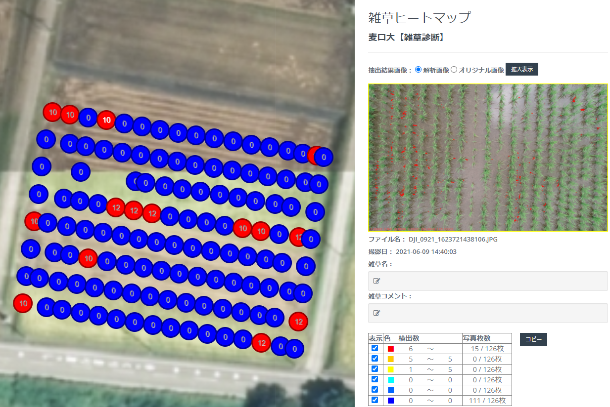

<!--
_class: lead
_paginate: false
_header: ""
-->

# 1. スマート農業を試してみませんか

～ 2021年チャレンジしてみたこと ～
～ ウェビナー※での情報展開 ～

※ウェブによるセミナーの略

---

# 2. 目次

<a href="#3">3. 導入</a> 
<a href="#4">4. 背景と目的</a> 
<a href="#5">5. ドローン</a> 
<a href="#6">6. トラクターナビ</a> 
<a href="#7">7. スマート農業推進フォーラム</a> 

<a href="#8">8. 土壌調査</a> 
<a href="#9">9. 【余談1】能美市たけもと農場</a> 
<a href="#10">10. 【余談2】圃場管理、作業管理</a> 
<a href="#11">11. 質問</a> 
<a href="#12">12. なぜ自分か？</a> 

---

- [1. スマート農業を試してみませんか](#1-スマート農業を試してみませんか)
- [2. 目次](#2-目次)
- [3. 導入](#3-導入)
  - [3.1. スマート農業の12カテゴリー(1)](#31-スマート農業の12カテゴリー1)
  - [3.2. スマート農業の12カテゴリー(2)](#32-スマート農業の12カテゴリー2)
  - [3.3. スマート農業のコスト感](#33-スマート農業のコスト感)
- [4. 背景と目的](#4-背景と目的)
- [5. ドローン](#5-ドローン)
  - [5.1. 雑草診断](#51-雑草診断)
    - [5.1.1. 期待](#511-期待)
  - [5.2. 葉色診断](#52-葉色診断)
    - [5.2.1. 期待](#521-期待)
  - [5.3. 導入する上での構成物](#53-導入する上での構成物)
- [6. トラクターナビ](#6-トラクターナビ)
  - [6.1. 使用中イメージ](#61-使用中イメージ)
  - [6.2. 使用中の期待](#62-使用中の期待)
  - [6.3. 使用後イメージ1](#63-使用後イメージ1)
  - [6.4. 使用後イメージ2](#64-使用後イメージ2)
  - [6.5. 使用後の期待](#65-使用後の期待)
  - [6.6. 導入する上での構成物](#66-導入する上での構成物)
  - [6.7. 導入する上での注意点](#67-導入する上での注意点)
- [7. スマート農業推進フォーラム2021 in 北陸の情報共有](#7-スマート農業推進フォーラム2021-in-北陸の情報共有)
  - [7.1. 水田作におけるスマート農業実証プロジェクトの取組と今後の課題](#71-水田作におけるスマート農業実証プロジェクトの取組と今後の課題)
    - [7.1.1. 経営分析の概要](#711-経営分析の概要)
  - [7.2. RTK（GPS）固定基地局の設置に伴う福井県の現状と動向について](#72-rtkgps固定基地局の設置に伴う福井県の現状と動向について)
    - [7.2.1. スマート農機具(自動操舵)の対象, 期待される導入効果](#721-スマート農機具自動操舵の対象-期待される導入効果)
    - [7.2.2. 実証結果](#722-実証結果)
- [8. 土壌調査](#8-土壌調査)
  - [8.1. 土壌調査で分かる内容](#81-土壌調査で分かる内容)
- [9. 【余談1】能美市たけもと農場さん](#9-余談1能美市たけもと農場さん)
- [10. 【余談2】圃場管理、作業管理](#10-余談2圃場管理作業管理)
- [11. 質問](#11-質問)
- [12. なぜ自分か？](#12-なぜ自分か)

---

# 3. 導入

農林水産省発表におけるスマート農業について
- [「農業新技術 製品・サービス集」](https://www.maff.go.jp/j/kanbo/smart/products.html)には12カテゴリーが分類
- [「スマート農業技術カタログ」](https://www.maff.go.jp/j/kanbo/smart/smart_agri_technology/smartagri_catalog.html)には286サービス※
※2022/1/29現在

---

## 3.1. スマート農業の12カテゴリー(1)

| No.                               | 内容                                               |
| --------------------------------- | -------------------------------------------------- |
| 1                                 | 経営管理システム                                   |
| 2                                 | ロボットトラクター                                 |
| 3 | 自動操舵システム   |
| 4                                 | トラクター（自動操舵機能付き）                     |
| 5                                 | 高性能田植機（直線アシスト機能・可変施肥機能付き） |
| 6                                 | リモコン草刈機                                     |

---

## 3.2. スマート農業の12カテゴリー(2)

| No.                                | 内容                                                                                 |
| ---------------------------------- | ------------------------------------------------------------------------------------ |
| 7                                  | 高性能コンバイン（収量等センサ・直線アシスト機能付き）                               |
| 8                                  | アシストスーツ                                                                       |
| 9                                  | 農業用ドローン・人工衛星（サービスを含む）                                           |
| 10                                 | 水管理システム                                                                       |
| 11 | ほ場・施設環境モニタリング（環境制御システムを含む） |
| 12                                 | その他農産関係                                                                       |

---
<!--
_footer: "出展：スマート農業新技術 製品サービス集(農林水産省)／引用：FOODBOX株式会社 ウェビナー内資料"
-->

## 3.3. スマート農業のコスト感

---

# 4. 背景と目的

1. スマート農業を取り入れて楽を模索したい
1. 今後のために親がやっていることをデータとして残していきたい
→ 結果の可視化
1. (可能であれば)上記を元にいろいろ検討、データ解析できれば
1. (可能であれば)情報を共有していきたい

---

# 5. ドローン

ドローンにより圃場を撮影し、
撮影できた画像を活用したい

---

## 5.1. 雑草診断

移植後５～７週
ベストは水抜き後
(水があっても太陽の位置を気にすればOK)
　　　～～～Ｑ要確認

---

### 5.1.1. 期待

* 雑草の分布を知ることで、除草剤散布が可変にできる
  * 使用量を減らせる
    * 経費を減らせる

---

## 5.2. 葉色診断

穂肥判断用

---

### 5.2.1. 期待

* 生育状況を分布を知ることで、穂肥散布が可変にできる
  * 使用量を減らせる
    * 経費を減らせる

---

## 5.3. 導入する上での構成物

* ドローンセット【自前／レンタル／購入】
  * 本体
  * プロポ
  * バッテリー
  * マイクロSDカード
* ドローン設定、確認用タブレット【自前／レンタル／購入】
※:warning: DJI製の場合、iPad(iPadOS)が必要
* 画像解析用のサービス【購入】
  * 今回使用：[葉色解析サービス IROHA](https://smx-iroha.com/)

---

# 6. トラクターナビ

以下を使用することで以降のような期待する
- 約1cm精度のGPS
- トラクター向けナビアプリ
- *(いずれは直進アシストハンドルを導入したいなぁ・・・)*

今回使用したアプリ：[AgriBus-NAVI](https://agri-info-design.com/agribus-navi/)

---

## 6.1. 使用中イメージ

---

## 6.2. 使用中の期待

* トラクターを運転するときの直進の目安にできる
* 作業した場所が分かる
  * 代掻き等の作業
  * 肥料等の散布

---

## 6.3. 使用後イメージ1

以下のような情報が分かる
1. 作業開始～終了時間
1. 圃場毎の作業面積
1. 圃場毎の作業距離
1. 作業箇所の塗りつぶし状況

---

## 6.4. 使用後イメージ2

以下のような情報が分かる
→日／週／月毎
1. 作業圃場数
1. 走行距離
1. 作業面積
1. 作業時間
1. 平均速度
1. 作業軌跡

---

## 6.5. 使用後の期待

* 複数人で作業している場合、
  * 作業詳細を共有できる
  * 作業内容の妥当性を検証できる
* 作業内容を蓄積した結果、今までの結果を比較できる

---

## 6.6. 導入する上での構成物

* トラクターに取り付けるアンテナ【レンタル／購入】
* トラクターに取り付けるタブレット／スマホ【自前／レンタル】
※:warning: Android5.0以上 (iPhone不可)
* トラクター位置補正用の基準局【レンタル／購入】
* トラクター位置補正用のデータ転送【(無料／有料)サービス】

---

## 6.7. 導入する上での注意点

:warning: AgriBus-NAVIには無料版／有料版がある ※[参照](https://agri-info-design.com/agribus-navi/)
　→無料版の場合、作業履歴が残るのは2日間
:warning: アプリの設定はトラクター毎に必要
:warning: 機材を導入すれば直進アシストも可能 ※[参照](https://agri-info-design.com/agribus-autosteer-lp/)

<strong>今現在、模索している内容</strong>
:warning: トラクター開始位置の目安となる2周内側の場所を知る方法
:warning: 田植え機の場合、田植え開始位置を知る方法

---

# 7. スマート農業推進フォーラム2021 in 北陸の情報共有

[スマート農業推進フォーラム2021 in 北陸](https://www.maff.go.jp/hokuriku/seisan/smart/forum.html)

1. みどりの食料システム戦略におけるスマート農業の果たす役割
1. 水田作におけるスマート農業実証プロジェクトの取組と今後の課題
1. WAGRI実装をめざした『水稲・小麦・大豆の栽培管理支援Web-API』の開発について
1. 総務省における農業関連施策の紹介
1. RTK（GPS）固定基地局の設置に伴う福井県の現状と動向について

---

## 7.1. 水田作におけるスマート農業実証プロジェクトの取組と今後の課題

1. スマート農業実証プロジェクトの取組状況
1. スマート農業技術一貫体系
1. ロボットトラクタの導入
1. 直進アシスト田植機の導入
1. 自動水管理システムの導入
1. 散布用ドローンの導入
1. 計測用ドローンの導入

---
8. 自動運転収量計測コンバインの導入
1. 通信機能付き乾燥機を用いた仕分け乾燥
1. 実証地区における労働時間、収量の変化
1. 経営分析の概要
1. 収益向上の取り組み
1. 営農管理システムの活用
1. 取組の評価

---
<!--
_color: red
-->
### 7.1.1. 経営分析の概要

* <strong>スマート農業技術の導入コストに見合うだけの面積で使用しないと生産費が増加し、収益が低下しやすい。</strong>
*  <strong>規模の小さい経営では10a当たりの機械償却費が増大しやすい。</strong>

---

## 7.2. RTK（GPS）固定基地局の設置に伴う福井県の現状と動向について

中田が取り組んだ内容を、
県が各農家さんに導入してもらうために取り組んだ

実証の結果：
自動運転機能等の活用により、<u>労働時間の削減、未熟者の作業実施、作業負担の経験が図られた</u>

---

### 7.2.1. スマート農機具(自動操舵)の対象, 期待される導入効果

1. 対象作業
   1. 耕耘、畔塗、溝堀、代掻き、播種、田植え、施肥、防除、収穫 等
1. 導入効果
   1. 労働環境改善、作業柔軟性の向上、費用(経費)削減
      1. 作業の軽減 ⇒ 疲労、ストレス軽減
      1. 作業の熟練度が不要 ⇒ 育成期間短縮(育成経費削減)
      1. 作業の中断・再開が容易 ⇒ 作業の柔軟性
      1. 夜間作業が可能 ⇒ 翌日の天候を考慮した柔軟性のある作業
      1. 肥料のまきむら、二重まきの防止 ⇒ 経費削減

---
<!--
_color: red
-->
### 7.2.2. 実証結果

---
<!--
_color: brown
-->
# 8. 土壌調査

土壌の傾向を知ることで、今後の肥料散布や土壌改良の参考にする
図はpH値例
赤：5.7 ～ 青：6

---

## 8.1. 土壌調査で分かる内容

依頼先は農協(ニトリ横)で無料でお願いできる
調査結果は依頼してから数ヶ月かかる

1. pH
2. 腐値
3. 有効態りん酸
4. 交換性加里
5. 有効態けい酸
6. 遊離酸化鉄

---
<!--
_color: red
-->

# 9. 【余談1】能美市たけもと農場さん

---

# 10. 【余談2】圃場管理、作業管理

圃場管理、作業管理はどうしていますか？

- AgriBus-NAVIの有料版
- [Xarvio(ザルビオ)](https://www.xarvio.com/jp/ja.html)
  - 2圃場までは無料
  - 衛星からの画像による生育診断
- IROHAも2022年4月頃から圃場管理機能を入れてくるらしい
- ビジョンテックから圃場管理サービス(生育モデル使用可)が
  2022年4月頃に開始すると聞いているが連絡待ち

---

# 11. 質問

- 遠隔地(例：ハウス内)の情報を知りたいですか？
  - 温度
  - 湿度
- IT絡みで支援して欲しいことはありますか？

---

# 12. なぜ自分か？

IT関連の仕事をしていて、PC関連には強い方だと思っている
自分の地元の高齢化していっているのを感じるので
少しでも助けになればと思って
近くの方が密にフォローができる
